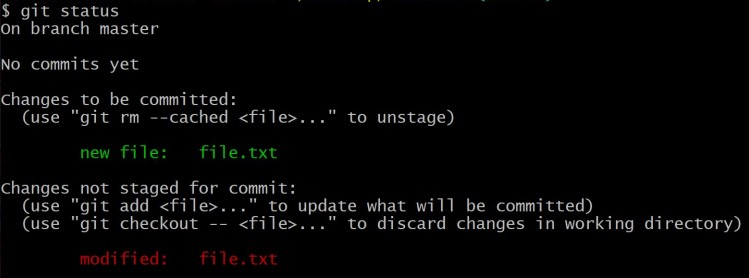

# Git 101

> "What is this Git thing all about ..?"
>
>> *Awareness is the greatest agent for change* <sub>Eckhart Tolle</sub>

## Git?
[Git](https://git-scm.com) is a version control system (VCS), which allows you to keep track of changes in files. It also coordinates the files and their changes among multiple people - a project team for example - or simply for yourself. Have a look at the [Pro Git](https://git-scm.com/book/en/v2) (Chacon and Straub, 2014) book to lift the lid on Git features.

Git is [widely used](https://en.wikipedia.org/wiki/Git) in industry as a VCS, and as such can be an essential skill to learn as part of your University studies. Many [existing](https://git-scm.com/book/en/v2/Appendix-A%3A-Git-in-Other-Environments-Graphical-Interfaces) coding tools have built-in Git extensions - including Visual Studio. These allow you to easily link your code project, Git and your chosen IDE.

Within Git, the files for each project that you create are collected together in a repository, or 'repo'. On your local computer, the project will contain a ```.git/``` folder containing all the information related to the files in the project, any changes over time, etc. If you delete this folder, your project is no longer considered a Git repo on your local computer.

The basic structure comprises of a 'local repository' which is on your computer, and this is linked to a 'remote repository' on Github. There are, in fact, four distinct that your files need to pass though:
1. The 'Working Directory'
2. The 'Staging Area'
3. The 'Local Repository'
4. The 'Remote Repository'

Everything you may do with Git involving moving files from your computer to a remote repository, and 'cloning' or downloading them from the remote to your computer, will involve moving between these four areas. 

 If you haven't already, create an account at [github.com](https://github.com)

## Getting Started
Also, if you haven't already, download and install Git for your OS from [here](https://git-scm.com/download/). Accept all default options. '```Git Bash Here```' should now be a context menu (right click in Windows) option.

You can create a repo and interact with Git in a number of ways - through an IDE such as Visual Studio, or manually.

#### Git in Visual Studio

Look [here](https://devblogs.microsoft.com/visualstudio/improved-git-experience-in-visual-studio-2019/) and [here](https://channel9.msdn.com/Shows/Visual-Studio-Toolbox/Git-Fundamentals) for information on the latest Git for Visual Studio developments (as of April 2020) and more tutorials. 

*To 'clone' or download a remote repository and open it in Visual Studio:*

```File > Clone or Checkout Code```

In the Github repo, see the green ```Clone or download``` button? Press this button, and the URL you see is the repository location. Copy and paste this into the ```Repository location``` field in Visual Studio.

*To add an existing project in Visual Studio to a version control system, such as Git:* 

With the project open, in the IDE, click ```Add to Source Control``` in the bottom right of the window, and then paste in your remote Git repository address. Click ```Publish``` and then you should see your project as a repo on Github.

 #### Git using Git bash

 Have a look at [this](https://www.atlassian.com/git/tutorials/git-bash) for more information on Git bash.

Create a new folder to hold your repository files. Then, right click on this folder - you should have the option ```Git Bash Here``` (if not, make sure you have Git installed on your computer, and you have selected the 'Windows Explorer integration' during the install process).

When you select ```Git Bash Here```, a Git Bash window will open, with it being located inside the folder. Now, you need to initialise this folder as a local repository. At the prompt, enter (the '$' is the prompt):

```bash
$git init
```
You should then see confirmation that this folder is now a Git repository. If you also look in the folder, you should see a ```.git/``` folder containing all of the repository information for Git. 

We have an empty directory, lets add a file. At the prompt, entr:

```bash
$touch file.txt
```
This will create a new, empty file for us, called ```file.txt``` (there are loads of other ways to create a file). This file is in our 'working directory'. We need to move it to the 'staging area' (files to be moved into a local and remote repository need to be 'staged' first, i.e., they need to be prepared or highlighted for 'commiting').

By adding this file to the staging area, it becomes 'tracked'. That is, Git starts monitoring it for changes, and it is ready for 'commiting' to your local repository. To do this, we use the '```add```' command in Git:

```bash 
#[adds 'file.txt' to the staging area]
$git add file.txt
```       
```bash
#[add all files in the working directory to the staging area - note the '.']
$git add .              
```
There are other versions of the ```add``` command, but these will be good for now.

You can check which files are in the staging area, by using the ```status``` command:

```bash
$git status
```
You should see an output like this, showing that ```file.txt``` is staged.


If you edit ```file.txt``` to change it, and then do a ```$git status``` again, you should then see:

This now shows there are two versions of ```file.txt``` - a tracked and untracked version. To apply the changes to the tracked version, do the ```$git add file.txt``` (or ```$git add .```) again.

