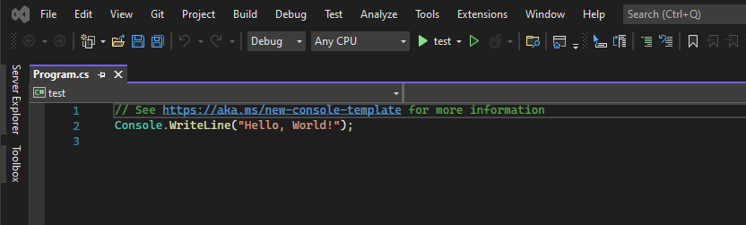
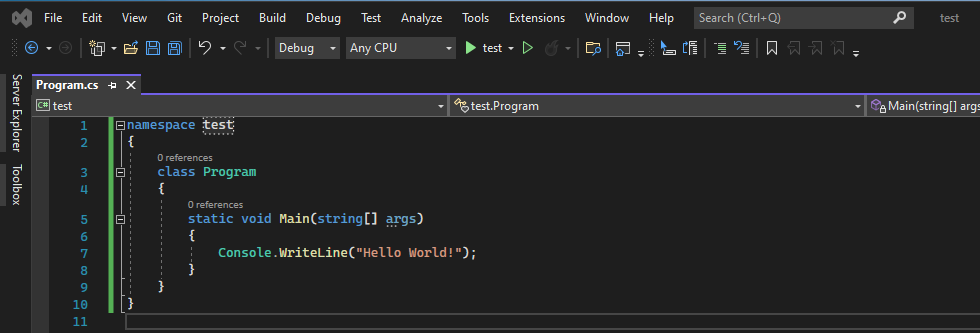

# Introducing C#

> "Introducing C#"
>
>> *Why do Java programmers have to wear glasses? Because they don’t C#.* <sub>Anon</sub>

1. [Why use C#?](#why)
2. [Programming C# - the IDE](#programming)
3. [VS2019 vs VS2022](#vs)
4. [First C# code](#first)

<a name="why"></a>
#### Why use C#?

- It is (relatively) easy to learn and use
- C# is an *object oriented language* which gives a clear structure to programs and allows code to be reused.
- As C# is a close relative  to C, C++ and Java, it makes it easy for programmers to switch between them.

<a name="programming"></a>
#### Programming C# - the IDE

An IDE (Integrated Development Environment) provides many facilities and functions for software development. For C#, I will use [Visual Studio](https://visualstudio.microsoft.com/) and examples will be shown in this form, however, many more IDEs for C# development exist. For example:

- [Visual Studio Code](https://code.visualstudio.com/)
- [Mono Develop](http://www.monodevelop.com/)
- plus many more.

We can write C# code (and saving the file with the ```.cs``` extension) with any text editor, such as notepad, notepad++, vim, vi, etc.

To compile code written with a text editor, you need to make sure you have a C# compiler installed.

It is easier if you don't want the footprint of an IDE on your computer to use online code editors and compilers:

- [.NET Fiddle](https://dotnetfiddle.net/)
- [replit](https://replit.com/languages/csharp)
- plus many more.

<a name="vs"></a>
#### VS2019 vs VS2022

If you already have VS2019 and want to upgrade to VS2022, there are a number of improvements, mainly in performance and productivity. Have a look [here](https://devblogs.microsoft.com/visualstudio/visual-studio-2022-now-available/) for more info.

The first thing you will notice though, is how the editor looks when you create a new code project:


If you want it to look more like your previous versions, then you can just replace that code with what you are used to:


<a name="first"></a>
#### First C# code


